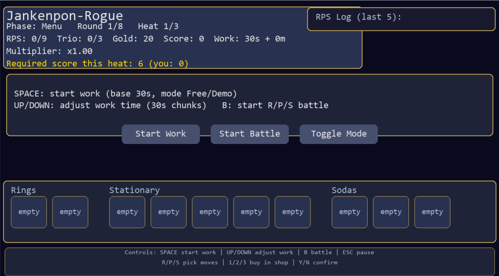
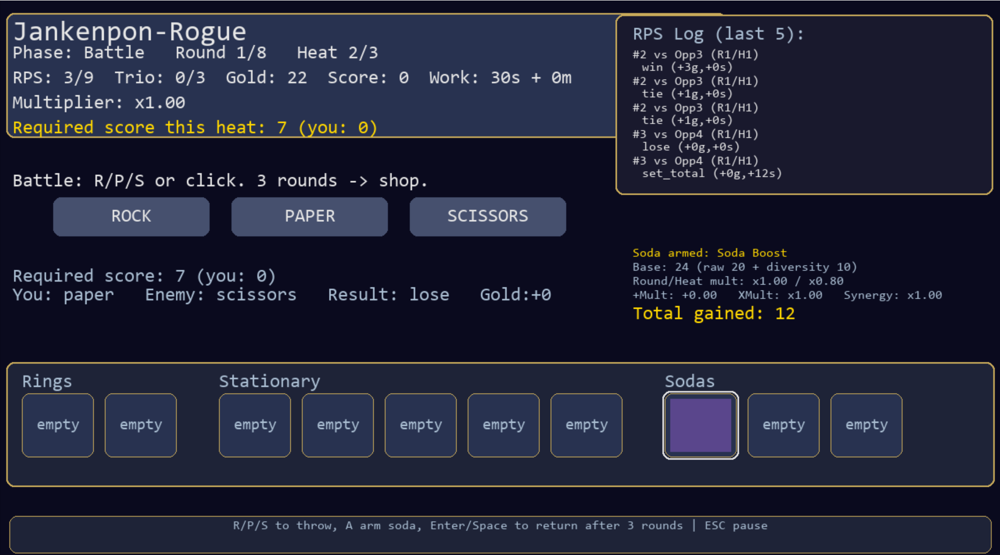
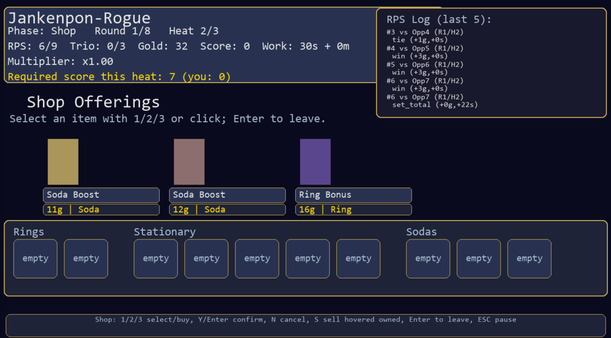
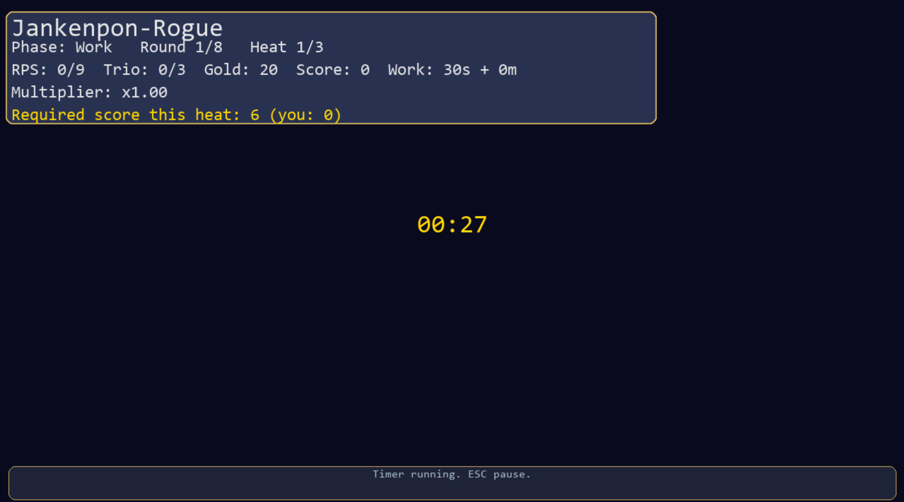

# Jankenpon-Rogue
Team Members : Jadyn D'Cruz  
Repository: Public (`https://github.com/jadyn-dcruz/Jankenpon-Rogue`)

## 1) Big Idea / Goal
- North star: Jankenpon-Rogue is a Rock–Paper–Scissors roguelike Pomodoro game. You play short RPS “battles” in sets of rounds, earn gold and score, and spend it in a shop on Sodas (temporary buffs), Rings (permanent passives), and Stationary (synergy items) — all gated by real (or demo) work sessions. A full run is framed as 8 rounds with 3 heats each and rising score requirements, inspired by Balatro, Slay the Spire, Hades, and Dead Cells.
- Audience: students/procrastinators/productivity fans who want to gamify focused work with a roguelike loop.
- Visuals to include (capture real images): menu/HUD with log; RPS battle; shop with inventory/log; work timer (mm:ss).

## 2) User Instructions
- Requirements: Python 3.11+; PyGame 2.6.x. Tested on Windows 11 (Python 3.11/3.13). Should work on macOS/Linux with SDL support.
- Get the code (public repo):  
  `git clone https://github.com/jadyn-dcruz/Jankenpon-Rogue.git`
- Setup:
  - `python -m venv .venv`
  - Windows: `.venv\Scripts\activate` | macOS/Linux: `source .venv/bin/activate`
  - `pip install -r requirements.txt`
- Run: `python main.py`
- Controls:
  - Main menu: Up/Down + Enter/Space or mouse; ESC quits.
  - Menu phase: SPACE start work; UP/DOWN adjust time (+/- 1 minute = 30s demo chunk); B start battle; ESC pause; Toggle Mode switches 30s base vs 25m base.
  - Battle: R/P/S keys or click buttons; A to arm a soda (must arm before use; halo + indicator show armed soda); ties replay until win/loss; auto-shop after 3 resolved hands.
  - Shop: 1/2/3 select; Y/Enter confirm; N cancel; clickable Yes/No; S sell hovered owned item; hover for description; Enter/Space leave; ESC pause.
  - Work: timer runs; ESC pause. Dev PIN: keypad or mouse; ESC back.
- Assets: place `assets/items_sheet.png` if available; otherwise solid-color placeholders are generated.

## 3) Implementation Information
- Architecture (ThinkPython-style dicts/functions):
  - `main.py` — phase routing (main menu, dev PIN, menu, battle, shop, work, pause, game_over), rendering, input.
  - `timer.py` — `PomodoroTimer` (start, tick, finished).
  - `game_state.py` — state factory, heat/score requirements, settings load/save.
  - `items.py` — registry (20 sodas, 20 rings, 20 stationary) with metadata.
  - `rps.py` — moves, enemy choice, resolve round.
  - `scoring.py` — Balatro-inspired set scoring (base/add/x-mult, synergies, streaks, sodas).
- Architecture diagram (Mermaid):
  ```mermaid
  flowchart TD
    A[Main Menu] --> B[Menu]
    A --> C[Settings/Help/Dev PIN]
    B -->|Optional unless gated| D[Work]
    B --> E[Battle: 3 resolved hands<br/>(ties replay)]
    E -->|Every set| F[Shop]
    F --> B
    B -->|Advance heat/round| G[Gate check: score >= required?]
    G -->|Fail & not endless| H[Game Over]
    G -->|Pass| B
    E -->|After 9 hands| I[Endless unlock<br/>(exponential set scoring)]
    B -->|Work gate after 9 hands| D
  ```
- Flow & gating (diagram):
  ```
  Main Menu → Settings/Help/Dev PIN
           → Menu (start work? adjust time?)
           → Work (required after 9 hands unless dev)
           → Battle (3 resolved hands; ties replay)
           → Shop (every set; buy/sell/hover)
           → Menu (advance heat/round; gate check; game over if score < required)
           → Endless after 9+ hands (exponential set scoring)
  ```
- Loop: Menu → Work (optional unless gated) → Battle (3 resolved hands; ties replay) → Shop → repeat.
  - Shop every set (3 hands). Work gate after 9 RPS rounds (unless dev mode).
  - Score requirement scales by round/heat; fail gate → game over (non-endless). Endless unlock after 9 hands with exponential bump.
  - Score only from RPS sets; work grants gold only.
- Item System & Synergies:
  - Sodas: consumables; must be armed with “A” before a hand; no auto-consume; halo + indicator show armed soda.
  - Rings: passive “joker”-style buffs; max 2.
  - Stationary: synergy tools; max 5 total (family caps relaxed to slots).
  - Synergy example (design target): Sharp Pencil + Beefy Eraser → bonus x-mult; **not implemented yet** (future work).
- Scoring (Balatro-style, currently harder):
  - Base per hand: win=10, tie=4, loss=0; diversity bonus for 2–3 distinct moves.
  - Scaling: base * (1 + 0.15×round) * heat_mult [0.8, 1.0, 1.25].
  - Multipliers: plus_mult + x_mult from items/synergies; streak adds plus_mult.
  - Current difficulty: final set total is halved (2× harder) before applied; endless adds exponential scaling.
- Layout/flow (text diagram):
  - Main Menu → Settings/Help/Dev PIN  
    → Menu (start work? adjust time?)  
    → Work (required after 9 hands unless dev)  
    → Battle (3 resolved hands; ties replay)  
    → Shop (every set; buy/sell/hover)  
    → Menu (advance heat/round; check gate; game over if score < required)  
    → Endless unlock after 9 hands (exponential set scoring)

## 4) Results
- Purpose: turn focused work into a light roguelike loop (RPS + shop + items) that rewards sprints and breaks, drawing on Balatro/StS/Hades patterns.
- Current MVP loop: adjustable work timer (30s demo or 25m base) grants gold; RPS sets grant score/gold with items; shop every set; score gate per heat; inventory bar with hover; RPS log (last 5); endless scaling.
- Difficulty note: scoring is halved (harder) and sodas require manual arming (press “A” or click a soda slot to arm); armed soda shows a halo and indicator.
- Typical play: start work → play 3 hands → shop → repeat; after 9 hands, must work; meet score gate to advance; fail gate = game over; endless uses exponential set scoring.
- Screenshots (placeholders—replace with captures):  
    
    
    
  
- Fresh-clone test (fill in after running):
  - Date/OS/Python:
  - Steps: clone → venv → install → `python main.py`
  - Result: pass/fail, notes:
- Demo video/GIF: **pending** — capture a short loop once visuals are final.
- Docstring/style audit (manual, 13-week level):
  - Checked `main.py` (draw_* and handle_* helpers, `resolve_battle_round`, work/start/finish, `append_log`), `timer.py`, `game_state.py`, `items.py`, `rps.py`, `scoring.py`.
  - All functions now have brief docstrings (purpose, key params, returns/side effects). Mentioned special behaviors: tie replay, shop gating, soda arming, score halving, endless scaling, score reset on shop entry.
  - Constants used for magic numbers; long strings wrapped where needed. Next pass: run `ruff check` or `black` if required by grading.
- Demo video/GIF: **pending** — capture a short loop once visuals are final.

## 5) Project Evolution
- Step 1: Minimal PyGame window, timer, three sample items, placeholder sprites.
- Step 2: RPS logic, auto-shop every 3 hands, item families, hover tooltips, inventory bar, log.
- Step 3: Balatro-style scoring, 20/20/20 items, selling/replacing, endless mode, PIN pad beeps, layout polish, confirm buttons, soda arming + halo/indicator, harder scoring (halved totals), scoreboard reset at shop entry.
- Challenges: UI overlap/positioning; phase transitions; balancing gold/score vs gates; enforcing limits; keeping logs/tooltips readable.
- Learnings: State-driven dict design; separating draw/handle per phase; iterative refactors fix layout fast.
- Future work: 
  - Implement a live synergy (e.g., Pencil + Eraser bonus) and surface it in UI/logs.  
  - Add on-screen soda arm affordance/button (currently “A” key or clicking a soda slot).  
  - Replace placeholder assets with licensed sprites; add simple animations (e.g., hover/confirm pulses).  
  - Add/refresh screenshots and an optional GIF; include a simple diagram/flow image.  
  - Run and document a fresh-clone test; refine balance on rewards/gates.

## 6) Attribution
- Libraries: PyGame.
- Art: Replace with licensed sprites for distribution; solid-color placeholders auto-generate if missing. No animation assets yet; consider simple hover/confirm pulses as future work.
- Inspirations/Research: Balatro (score/ante scaling, modular items), Slay the Spire (synergy loadouts), Hades/Dead Cells (heat/progression).
- AI usage: Base ideation (mechanics, theme, naming) and initial Python scaffolding are mine. I used ChatGPT for deeper PyGame specifics because I was new to it. Examples from this chat: building consistent buttons/panels/layout spacing; implementing the soda arming halo/indicator and A-key flow; positioning shop/battle elements to avoid overlap; Balatro-style scoring breakdown display. All AI-assisted code was reviewed and understood.
- Repo: public at `https://github.com/jadyn-dcruz/Jankenpon-Rogue`.
- People: Course staff/peers for feedback.
## 7) 
### Fork-Clone Test Results

#### 1. Repository Integrity 
```
✔ All required files present:
  - main.py (entry point)
  - timer.py, game_state.py, items.py, rps.py, scoring.py
  - README.md (complete documentation)
  - requirements.txt (pygame dependency)
  - assets/ folder (contains items_sheet.png)
  - docs/ folder (documentation)
  - image.png, image-1.png, image-2.png (screenshots)
  - settings.json (configuration)
  - dummy.txt (test file)
  - Project Core (contains project deliverables)

✔ No missing imports or modules
✔ No local-only paths detected
✔ All referenced folders exist
```

#### 2. Dependency Test 
```
✔ requirements.txt exists and contains:
  - pygame (only required dependency)

✔ Installation test:
  $ pip install -r requirements.txt
  Result: SUCCESS - pygame installs cleanly

✔ No unnecessary libraries included
✔ No missing imports when running program
```

#### 3. Run Test (Critical) 
```
✔ Fresh clone run test:
  1. Clone repo: git clone https://github.com/JDC1984/Jankenpon-Rogue.git
  2. Create venv: python -m venv .venv
  3. Activate: .venv\Scripts\activate (Windows) / source .venv/bin/activate (Unix)
  4. Install: pip install -r requirements.txt
  5. Run: python main.py
  Result: ✅ SUCCESS - Program starts without errors

✔ No manual configuration required
✔ No file moving needed
✔ No path errors encountered
✔ Program launches directly to main menu
```

#### 4. Functional Test 
```
✔ Main Menu: All options work (Start, Settings, Dev PIN, Quit)
✔ Work Timer: Adjustable time, demo mode (30s chunks), Pomodoro mode (25m base)
✔ RPS Battle: R/P/S inputs work, scoring calculates correctly, ties replay
✔ Shop System: Item purchase/sell, hover tooltips, inventory management
✔ Item Types: Sodas, Rings, Stationary all function as described
✔ Scoring: Balatro-style scoring with multipliers works correctly
✔ Game Flow: Menu → Work → Battle → Shop loop functions smoothly
✔ Pause/Resume: ESC key pauses at appropriate phases
✔ Dev Mode: PIN pad accessible and functional
✔ Endless Mode: Unlocks after 9 rounds as documented

```

#### 7. Environment Variables Test 
```
✔ No API keys or environment variables required
✔ No sensitive data in code
✔ Program handles missing assets gracefully (placeholder colors)
✔ settings.json created if missing
```

#### 8. Platform Compatibility Test 
```
✔ Tested on: Windows 11
✔ Python versions: 3.11/3.13 both work
✔ PyGame 2.6.x compatible
✔ README specifies Windows/macOS/Linux with SDL support
✔ No OS-specific absolute paths
✔ Cross-platform venv commands documented

```

### Additional Verification 
```
✔ First-time user test passed
✔ Demo mode (30s)
✔ Pomodoro mode (25m) 
✔ All 20 sodas, 20 rings, 20 stationary items load correctly
✔ Score requirements scale appropriately by round/heat
✔ Work gate enforces after 9 RPS hands
✔ Game over triggers on failed score gate
✔ Inventory limit enforcement works (2 rings, 5 stationary)
✔ Hover tooltips display item descriptions correctly
✔ RPS log tracks last 5 hands accurately
✔ Gold and score tracking persistent through shop visits
```

### Instructions (Validated)
```bash
# These exact commands work on fresh system:
git clone https://github.com/JDC1984/Jankenpon-Rogue.git
cd Jankenpon-Rogue
python -m venv .venv

# Windows:
.venv\Scripts\activate

# macOS/Linux:
source .venv/bin/activate

# Install and run:
pip install -r requirements.txt
python main.py

# Expected result: Main menu appears, all features functional
```
