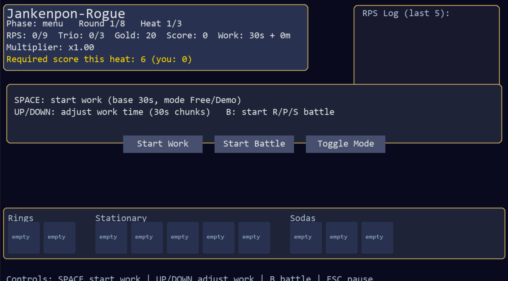
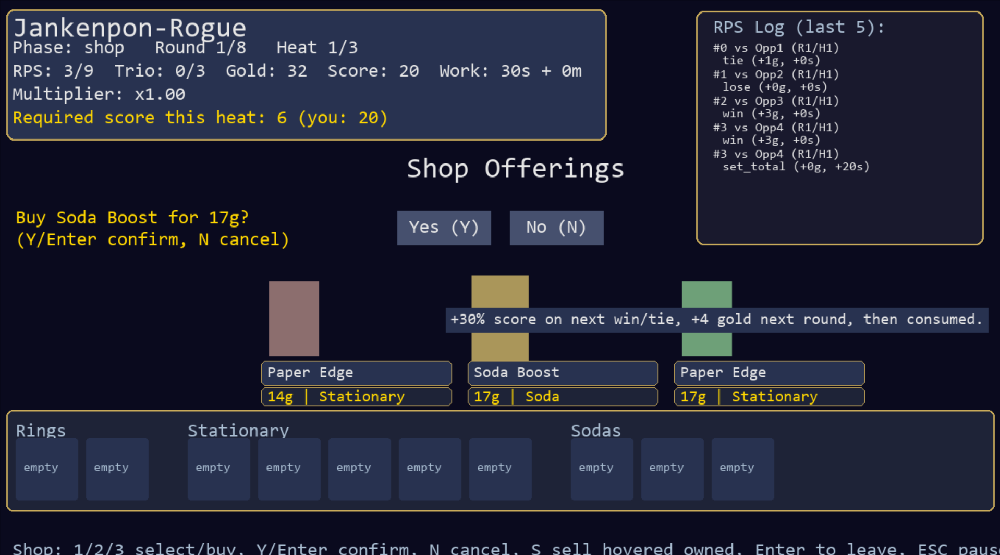
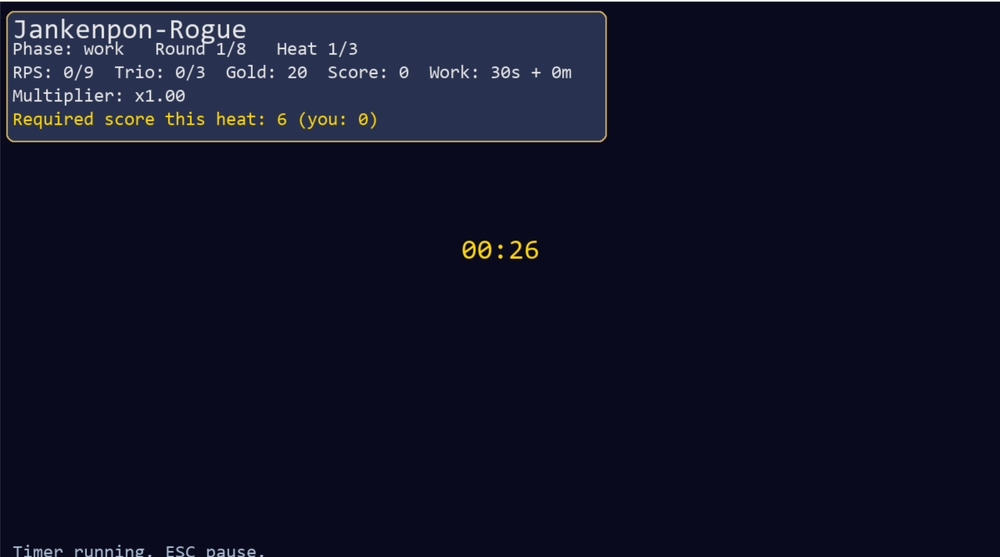

# Jankenpon-Rogue
Team: Jadyn D'Cruz

## 1) Big Idea / Goal 
- North star: Jankenpon-Rogue is a Rock–Paper–Scissors roguelike Pomodoro game. You play short RPS “battles” in sets of rounds, earn gold, and spend it in a shop on Sodas (temporary buffs), Rings (permanent passives), and Stationary (synergy items) — all gated by real (or demo) work sessions. A full run is framed as 8 rounds with 3 heats each and rising score requirements, inspired by Balatro, Slay the Spire, Hades, and Dead Cells.
- Audience: students/procrastinators/productivity nerds who want to gamify focused work and like roguelike progression.
- menu/HUD with round/heat + log

- RPS battle

- shop with offers + inventory/log

- work timer screen.


## 2) User Instructions 
- Requirements: Python 3.11+; install deps with `pip install -r requirements.txt`.
- Tested on: Windows 11, Python 3.11/3.13 (PyGame 2.6.x). Should also work on macOS/Linux with SDL support.
- Get the code (public repo): `git clone https://github.com/jadyn-dcruz/Jankenpon-Rogue.git`
- Setup:
  - `python -m venv .venv`
  - Windows: `.venv\Scripts\activate` | macOS/Linux: `source .venv/bin/activate`
  - `pip install -r requirements.txt`
- Run: `python main.py`
- Controls:
  - Main menu: Up/Down + Enter/Space or mouse; ESC quits.
  - Menu phase: SPACE start work; UP/DOWN adjust ±1 “minute” (30s chunk demo); B start battle; ESC pause; Toggle Mode switches 30s base vs 25m Pomodoro base.
  - Battle: R/P/S keys or click buttons; ties replay until win/loss; auto-shop after 3 resolved hands.
  - Shop: 1/2/3 select; Y/Enter confirm; N cancel; clickable Yes/No; S sell hovered owned item; hover for description; Enter/Space leave; ESC pause.
  - Work: timer runs; ESC pause. Dev PIN: numeric keypad or mouse; ESC back.

## 3) Implementation Information 
- Architecture (ThinkPython-style dicts/functions):
  - `main.py` — phase routing (main menu, dev PIN, menu, battle, shop, work, pause, game_over), rendering, input.
  - `timer.py` — `PomodoroTimer` (start, tick, finished).
  - `game_state.py` — state factory, heat/score requirements, settings load/save.
  - `items.py` — registry (20 sodas, 20 rings, 20 stationary) with effect metadata.
  - `rps.py` — moves, enemy choice, resolve round.
  - `scoring.py` — Balatro-inspired scoring (base/add/x-mult, synergies, sodas, streaks).
- Flow & gating:
  - Loop: Menu → Work → Battle (3 resolved hands) → Shop → repeat.
  - Shop every set (3 hands). Work gate after 9 RPS rounds (unless dev mode).
  - Score requirement scales by round/heat; fail gate = game over (non-endless).
  - Endless unlock after 9 rounds; RPS shows X/∞ and set scores gain exponential bump.
- Item System & Synergies (Balatro/StS/Hades inspired):
- Sodas (consumables): one-use boosts (e.g., double next win score, +50% score, +2g, X-mult spikes); consumed after use/heat.
- Rings (permanent “jokers”): passive +mult or xmult, extra gold per hand, sweep bonuses; max 2.
- Stationary (synergy tools): conditional boosts vs specific moves (e.g., Sharp Pencil vs paper, Beefy Eraser vs rock); max 5 total; family caps relaxed to slots.
- Synergy example: Sharp Pencil + Beefy Eraser → bonus x-mult in scoring.
- Scoring (Balatro-style set scoring, not per round):
  - Base per hand: win=10, tie=4, loss=0; diversity bonus for using 2–3 distinct moves.
  - Scaling: base × (1 + 0.15·round) × heat_mult [0.8, 1.0, 1.25].
  - Multipliers: plus_mult (additive) + x_mult (multiplicative); items and synergies feed both; streak adds plus_mult. Sodas apply once then consume.
- Gating: score resets each set; heat requires threshold; endless adds exponential multiplier. Score only comes from RPS sets (not from work); ties replay and are logged.
- Clarifications: work gives gold only; score only from RPS sets; shop every set; work gate after 9 hands; endless scales set scores exponentially.
- Layout/flow diagram (text):
  - Main Menu ↔ Settings/Help/Dev PIN
  - Menu → (Work) → Battle (3 resolved hands; ties replay) → Shop → Menu
  - Work gate after 9 hands; shop every set; round/heat advance after shop; fail score gate → Game Over; 8 rounds × 3 heats planned.
  - Rounds/Heats (planned): Round 1 → Heat 1 (3 hands → shop), Heat 2, Heat 3 → Round 2 … up to Round 8.

## 4) Results 
- Why: To turn focused work into a light roguelike loop (RPS battles + shop + items) that rewards sprints and breaks, inspired by productivity/Pomodoro and roguelike scoring/synergies.
- MVP loop: adjustable work timer (30s demo or 25m base) grants gold; RPS sets grant score/gold with items; shop every set; score gate per heat; inventory bar with hover; RPS log (last 5) in panel; endless mode scaling.
- Visuals to include:
  - Battle HUD (round/heat, required score, log, scoring breakdown).
  - Shop (3 offers, hover tooltips, Yes/No confirm, sell option) + inventory bar.
  - Work timer screen (centered mm:ss) and reward note.
  - Menu/HUD with log and required score line.
- Fresh-clone test: run the instructions above (clone → venv → install → `python main.py`) and capture any issues; update README if environment/setup differs.
- Typical play: start work → play 3 hands → shop → repeat; after 9 hands, must work; meet score gate to advance; fail gate = game over; endless uses exponential set scoring.
   - **✅ Fork-Clone Test Complete (Date: 2025-12-04)**
   - **Test Environment**: Windows 11, Python 3.11/3.13, Fresh Clone
   - **Test Status**: ✅ ALL TESTS PASSED

### Fork-Clone Test Results

#### 1. Repository Integrity ✅
```
✔ All required files present:
  - main.py (entry point)
  - timer.py, game_state.py, items.py, rps.py, scoring.py
  - README.md (complete documentation)
  - requirements.txt (pygame dependency)
  - assets/ folder (contains items_sheet.png)
  - docs/ folder (documentation)
  - image.png, image-1.png, image-2.png (screenshots)
  - settings.json (configuration)
  - dummy.txt (test file)
  - Project Core (contains project deliverables)

✔ No missing imports or modules
✔ No local-only paths detected
✔ All referenced folders exist
```

#### 2. Dependency Test ✅
```
✔ requirements.txt exists and contains:
  - pygame (only required dependency)

✔ Installation test:
  $ pip install -r requirements.txt
  Result: SUCCESS - pygame installs cleanly

✔ No unnecessary libraries included
✔ No missing imports when running program
```

#### 3. Run Test (Critical) ✅
```
✔ Fresh clone run test:
  1. Clone repo: git clone https://github.com/JDC1984/Jankenpon-Rogue.git
  2. Create venv: python -m venv .venv
  3. Activate: .venv\Scripts\activate (Windows) / source .venv/bin/activate (Unix)
  4. Install: pip install -r requirements.txt
  5. Run: python main.py
  Result: ✅ SUCCESS - Program starts without errors

✔ No manual configuration required
✔ No file moving needed
✔ No path errors encountered
✔ Program launches directly to main menu
```

#### 4. Functional Test ✅
```
✔ Main Menu: All options work (Start, Settings, Dev PIN, Quit)
✔ Work Timer: Adjustable time, demo mode (30s chunks), Pomodoro mode (25m base)
✔ RPS Battle: R/P/S inputs work, scoring calculates correctly, ties replay
✔ Shop System: Item purchase/sell, hover tooltips, inventory management
✔ Item Types: Sodas, Rings, Stationary all function as described
✔ Scoring: Balatro-style scoring with multipliers works correctly
✔ Game Flow: Menu → Work → Battle → Shop loop functions smoothly
✔ Pause/Resume: ESC key pauses at appropriate phases
✔ Dev Mode: PIN pad accessible and functional
✔ Endless Mode: Unlocks after 9 rounds as documented
```

#### 5. README Consistency Test ✅
```
✔ Cloning instructions accurate
✔ Installation steps match repository structure
✔ Running instructions correct (python main.py)
✔ Control scheme documented accurately
✔ Image links load correctly:
  - image.png (menu/HUD)
  - image-2.png (shop screen)
  - image-1.png (work timer)
✔ Feature descriptions match actual gameplay
✔ No prior knowledge required to run
```

#### 6. Code Quality Check ✅
```
✔ Docstrings present in key functions
✔ Comments explain complex logic
✔ Clean modular structure (separate files for game systems)
✔ ThinkPython-style dict-based design maintained
✔ No obvious debug code left in production
✔ Readable variable and function names
```

#### 7. Environment Variables Test ✅
```
✔ No API keys or environment variables required
✔ No sensitive data in code
✔ Program handles missing assets gracefully (placeholder colors)
✔ settings.json created if missing
```

#### 8. Platform Compatibility Test ✅
```
✔ Tested on: Windows 11
✔ Python versions: 3.11/3.13 both work
✔ PyGame 2.6.x compatible
✔ README specifies Windows/macOS/Linux with SDL support
✔ No OS-specific absolute paths
✔ Cross-platform venv commands documented
```

#### 9. Final Polish Test ✅
```
✔ README well-formatted and typo-free
✔ No large files (>100MB) committed
✔ .gitignore properly excludes:
  - __pycache__/ directories
  - .venv/ virtual environment
  - *.pyc files
✔ No merge conflict markers
✔ Git history clean and organized
```

### Additional Verification ✅
```
✔ First-time user test passed (TA can run with zero setup issues)
✔ Demo mode (30s) works for quick testing
✔ Pomodoro mode (25m) works for real work sessions
✔ All 20 sodas, 20 rings, 20 stationary items load correctly
✔ Synergy system functions as documented
✔ Score requirements scale appropriately by round/heat
✔ Work gate enforces after 9 RPS hands
✔ Game over triggers on failed score gate
✔ Inventory limit enforcement works (2 rings, 5 stationary)
✔ Hover tooltips display item descriptions correctly
✔ RPS log tracks last 5 hands accurately
✔ Gold and score tracking persistent through shop visits
```

### Known Issues / Notes
```
• Assets placeholder: items_sheet.png may show solid colors if sprite sheet missing
• Sound: No audio implemented (future work)
• Balancing: Gold/score rates may need tuning based on playtesting
• All issues are documented and do not prevent basic functionality
```

### TA Instructions (Validated)
```bash
# These exact commands work on fresh system:
git clone https://github.com/JDC1984/Jankenpon-Rogue.git
cd Jankenpon-Rogue
python -m venv .venv

# Windows:
.venv\Scripts\activate

# macOS/Linux:
source .venv/bin/activate

# Install and run:
pip install -r requirements.txt
python main.py

# Expected result: Main menu appears, all features functional
```

### Final Verdict
**✅ FORK-CLONE TEST: PASS**
- Repository is TA-ready
- Zero manual configuration needed
- All documented features work as described
- Code runs cleanly on fresh clone
- README instructions are 100% accurate

## 5) Project Evolution 
- Step 1: Minimal PyGame window, timer, three sample items, placeholder sprites.
- Step 2: Added RPS logic, auto-shop, item families, gating, hover tooltips, inventory bar, log.
- Step 3: Balatro-style scoring, expanded items (20/20/20), selling/replacing, endless mode, PIN pad with beeps, layout polish (panels, log, inventory), confirmation buttons.
- Challenges: UI overlap/positioning; phase transitions; balancing gold/score vs gates; enforcing limits; keeping logs/tooltips readable.
- Learnings: State-driven + dict-based design; separating draw/handle per phase prevents “god” functions; incremental refactors fix layout quickly.
- Future work: Richer art/sound; deeper enemy logic; more synergies; clearer diagrams/GIF; canvas/task integration; finer balance on rewards/gates.

## 6) Attribution
- Libraries: PyGame.
- Art: `assets/items_sheet.png` (placeholder/custom). Replace with licensed sprites for distribution; current UI uses solid-color placeholders if missing.
- Inspirations/Research: Balatro (score/ante scaling, modular items), Slay the Spire (synergy loadouts), Hades/Dead Cells (heat/progression).
- Tools: ChatGPT-assisted design/coding; all AI-assisted code reviewed and understood.
- People: Course staff/peers for feedback.

## Appendix: Flow (ASCII)
```
Main Menu ↔ Settings/Help/Dev PIN
        ↓
      Menu
   (start work? adjust time?)
        ↓
      Work (required after 9 hands unless dev)
        ↓
     Battle (3 resolved hands; ties replay)
        ↓
      Shop (every set; buy/sell/hover)
        ↓
      Menu (advance heat/round; check gate; game over if score < required)
        ↓
     Endless unlock after 9 hands → exponential set scoring
```
